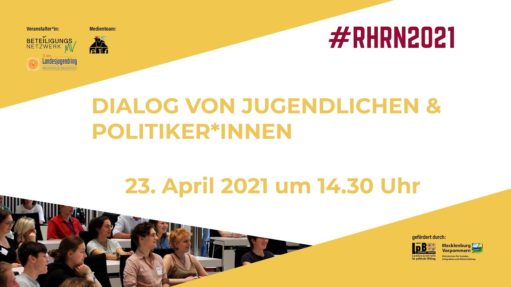

# Workadventure benutzen

Dieses Tutorial soll einen kurzen Überblick und Empfehlungen für eine entspannte Konferenz-Erfahrung bieten.

## Umgang miteinander

Bitte verhaltet Euch achtsam gegenüber anderen Teilnehmer:innen. 
Wir behalten uns vor, aktiv zu werden, wenn sich Teilnehmer:innen nicht entsprechend verhalten.

## Bildrechte

Ihr habt alle vor der Veranstaltung eine Einverständniserklärung unterschrieben. Es ist trotzdem wichtig, achtsam mit anderen umzugehen und zu beachten, dass nicht alle unbedingt fotografiert werden möchten, vor allem wenn es um informelle Momente außerhalb des Programms geht. Falls Ihr Bilder oder Screenshots macht, bittet alle im Bild um Erlaubnis oder spart Gesichter und Namen aus!

## Technische Hinweise
### Hardware / Geräte

Ihr braucht einen Computer oder mindestens ein Gerät mit physischer Tastatur. Ein Tablet mit Tastatur funktioniert auch.
Da die Gegenwartskonferenz ein interaktives Multiplayer-Erlebnis ist, werden Kamera und Mikrofon empfohlen. Ihr braucht sie aber nicht zwingend, um teilzunehmen. Interaktionen mit anderen werden ohne aber sehr langweilig sein.

### Browser

Die Gegenwartskonferenz sollte mit allen gängigen Browsern funktionieren, es kann aber je nach verwendetem Browser kleinere Probleme geben. Stelle vor der Veranstaltung sicher, dass dein Browser aktualisiert ist! Ansonsten kann es sein, dass deine Kamera und dein Mikrofon nicht funktionieren.

### Steuerung

Du kannst Dich auf der Karte mit den Pfeiltasten oder mit den Tasten W, A, S und D bewegen. Um zu rennen, muss du Shift (die Pfeile links von deiner Tastatur, die über Strg ist) gedrückt halten.

### Rein und raus zoomen

Um einen besseren Überblick über die Karte zu bekommen, kannst Du mittels Strg +/- (beide gleichzeitig drücken) rein und rauszoomen.

### Audio

In manchen Bereichen (Tipp: Gucke mal beim Klavier vorbei!) wird ein Audioplayer am oberen linken Bildschirmrand aufploppen und Sound abspielen. Auf der linken Seite findest Du eine Stummschaltetaste, falls Du keine Lust auf Geräusche hast. 

### Gruppenunterhaltungen

Wenn Du andere Teilnehmer*innen auf der Karte triffst, wird eine Gruppenunterhaltung gestartet und Deine Kamera und Dein Mikrofon mit den anderen geteilt. Gruppenunterhaltungen werden durch einen weißen Kreis um die Teilnehmer*innen markiert. Sie können bis zu 4 Personen groß werden, danach sind sie "voll" und der Kreis wird rot dargestellt.

## Technischer Support

Wenn Du während der Veranstaltung technische Probleme hast, kannst du Dich an unserem technischen Support (Georg und Kenny) wenden. 
Beide kannst Du entweder direkt über Zoom oder Workadventure, oder per E-Mail unter rhrn.info@mailbox.org oder telefonisch unter 0157 33315668 (Georg) und 0170 8832316 (Kenny) erreichen.

